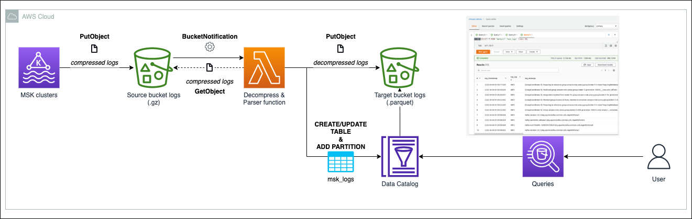
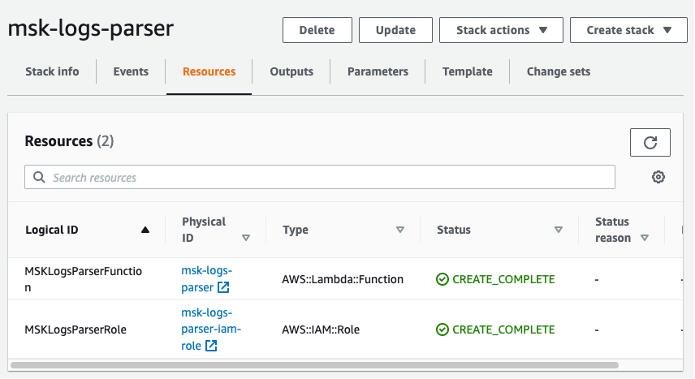
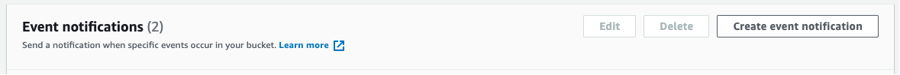
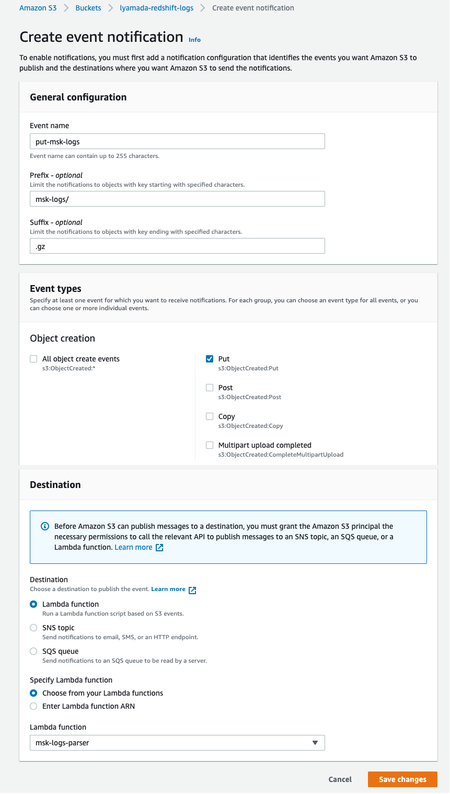
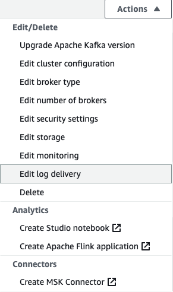
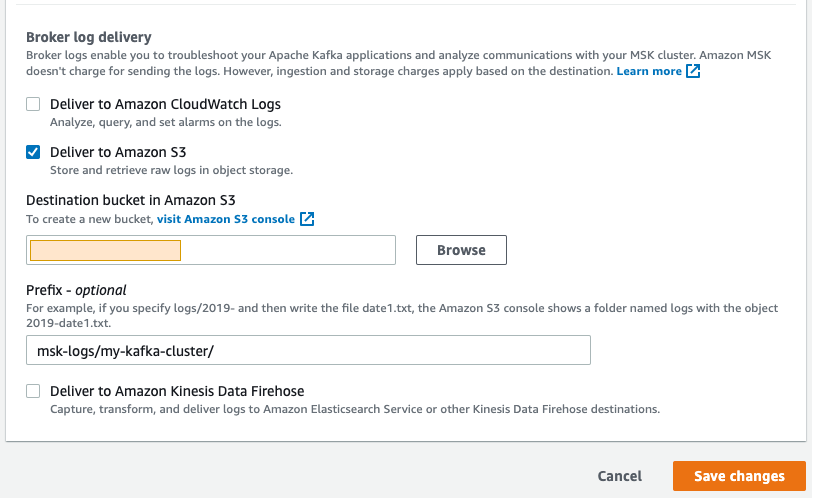
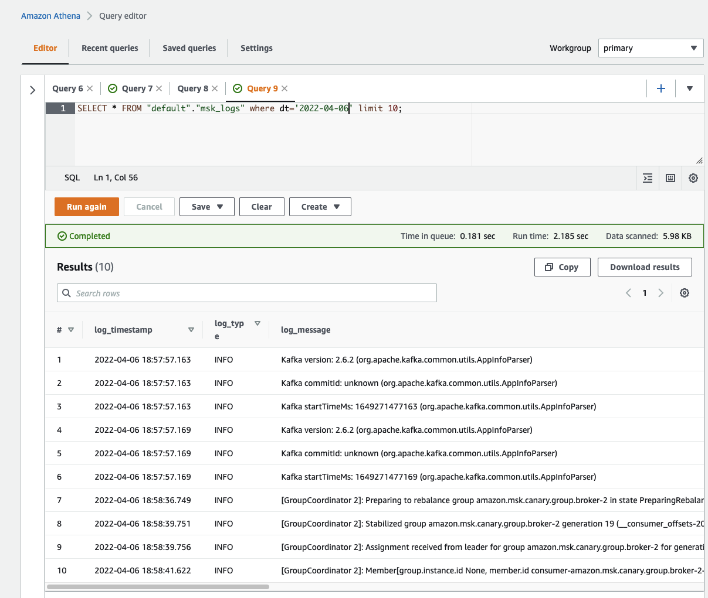

# msk-logs-parser

This AWS Lambda function is capable of decompress the compressed **broker logs** generated by Amazon MSK clusters (.gz format), parse the data, and save them into Amazon S3 as an AWS Glue table.

By leveraging on [AWS Data Wrangler](https://github.com/awslabs/aws-data-wrangler), the function can easily handle the management of the table inside the Glue Data Catalog, creating/updating the logs table and adding new partitions on every execution.


## Architecture




### Workflow

1. The compressed .gz files containing the brokers' logs are created in an Amazon S3 bucket.

2. The bucket's event notification will trigger the AWS Lambda parser function everytime an object with a specific prefix and suffix arrives through *PutObject*.

3. The AWS Lambda function **msk-logs-parser**:
    - reads the compressed log object
    - parses its data into a [Pandas dataframe](https://pandas.pydata.org/docs/reference/api/pandas.DataFrame.html)
    - saves the dataframe as parquet files into Amazon S3 and creates/updates the AWS Glue table, leveraging on [AWS Data Wrangler](https://github.com/awslabs/aws-data-wrangler) package

4. End-users are able to query the logs on Amazon Athena by consuming the logs table.


## Deploy & Setup

In order to deploy this stack by using the infra-as-code template it's required:
- an AWS account
- a terminal with [AWS CLI](https://aws.amazon.com/cli/) and [AWS SAM CLI](https://aws.amazon.com/serverless/sam/) installed


### HOW-TO

#### Step 1 - Setup
Before running the shell scripts available to enhance the deploy experience, please open both .sh files and replace the <ENTER_YOUR_DATA_HERE> placeholders with the values of your preference.

#### Step 2 - Package & Deploy
Now it's time to run the [deploy.sh](infra-as-code/destroy.sh) file.
This script will package your local template, uploading the lambda's Python code into the bucket of your preference, and finally build the AWS resources by using the AWS Serverless Model Application framework.

```
% sh infra-as-code/deploy.sh 
```

**Output**:
```
Successfully packaged artifacts and wrote output template to file ./infra-as-code/packaged.yaml.
Execute the following command to deploy the packaged template
sam deploy --template-file /<YOUR_PATH>/msk-logs-parser/infra-as-code/packaged.yaml --stack-name <YOUR STACK NAME>


        Deploying with following values
        ===============================
        Stack name                   : msk-logs-parser
        Region                       : <YOUR_REGION>
        Confirm changeset            : False
        Disable rollback             : False
        Deployment s3 bucket         : None
        Capabilities                 : ["CAPABILITY_NAMED_IAM"]
        Parameter overrides          : {}
        Signing Profiles             : {}

Initiating deployment
=====================

Waiting for changeset to be created..

CloudFormation stack changeset
-----------------------------------------------------------------------------------------------------
Operation                 LogicalResourceId         ResourceType              Replacement             
-----------------------------------------------------------------------------------------------------
+ Add                     MSKLogsParserFunction     AWS::Lambda::Function     N/A                     
+ Add                     MSKLogsParserRole         AWS::IAM::Role            N/A                     
-----------------------------------------------------------------------------------------------------

Changeset created successfully. arn:aws:cloudformation:<YOUR_REGION>:<YOUR_AWS_ACCOUNT_ID>:changeSet/samcli-deploy1649270332/0a0cbb3e-a511-49fd-a7bf-e317b9ad1543


2022-04-06 15:39:05 - Waiting for stack create/update to complete

CloudFormation events from stack operations
-----------------------------------------------------------------------------------------------------
ResourceStatus            ResourceType              LogicalResourceId         ResourceStatusReason    
-----------------------------------------------------------------------------------------------------
CREATE_IN_PROGRESS        AWS::IAM::Role            MSKLogsParserRole         -                       
CREATE_IN_PROGRESS        AWS::IAM::Role            MSKLogsParserRole         Resource creation       
                                                                              Initiated               
CREATE_COMPLETE           AWS::IAM::Role            MSKLogsParserRole         -                       
CREATE_IN_PROGRESS        AWS::Lambda::Function     MSKLogsParserFunction     -                       
CREATE_IN_PROGRESS        AWS::Lambda::Function     MSKLogsParserFunction     Resource creation       
                                                                              Initiated               
CREATE_COMPLETE           AWS::Lambda::Function     MSKLogsParserFunction     -                       
CREATE_COMPLETE           AWS::CloudFormation::St   msk-logs-parser           -                       
                          ack                                                                         
-----------------------------------------------------------------------------------------------------

Successfully created/updated stack - msk-logs-parser in <YOUR_REGION>
```

Checking on AWS Console > AWS CloudFormation


#### Step 3 - Creating the Event Notification (S3 to Lambda)
Once you have your stack in place, it's time to create the [Event Notification](https://docs.aws.amazon.com/AmazonS3/latest/userguide/NotificationHowTo.html) from your Amazon S3 bucket (storing the logs) to the AWS Lambda function.

Go to the **Amazon S3 Bucket** > "**Properties**" tab > "**Event notifications**" section > "**Create event notification**" button


In "**General configuration**" fill the following text fields:
|Parameter|Value|
|-|-|
|Event name|put-msk-logs|
|Prefix|<YOUR_PREFIX>|
|Suffix|.gz|

In "**Event types**" select only the **Put** option

In "**Destination**" select **Lambda function** and then specify the desired function '**msk-logs-parser**'

Example:


#### Step 4 - Turning on Broker Logs Delivery on Amazon MSK Cluster

Go to the **Amazon MSK Cluster** > "**Action**" button > "**Edit log delivery**" option


Select the checkbox "**Deliver to Amazon S3**", select the Amazon S3 bucket where the logs will be stored, and finally pass <YOUR_PREFIX>/<YOUR_CLUSTER_NAME>/ in the "**Prefix**" text field. "**Save changes**"


### ALL SET!

The AWS Glue Table is partitioned by:
- Cluster
    - Broker
        - Date

Allowing **performant** queries by filtering these attributes.

Now the logs are queryable through Amazon Athena. Try it yourself :)




